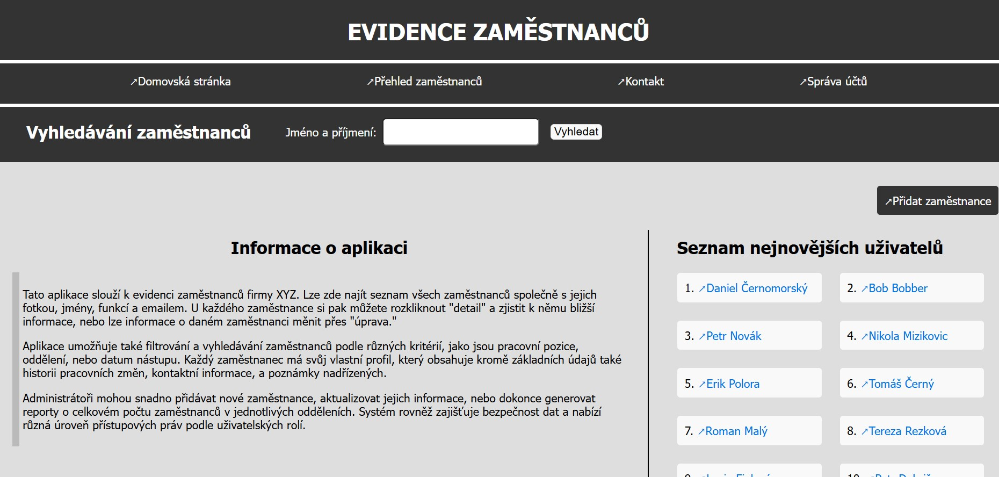
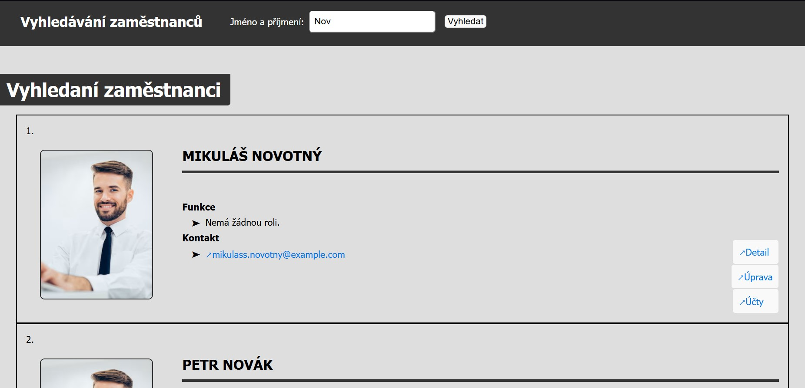
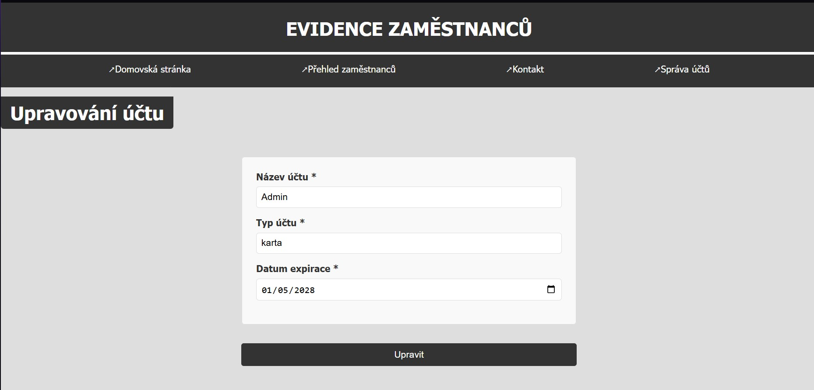

# Employee Records Web Application (Symfony Practice Project)

> 🧑‍💼 A practice project built with the **Symfony PHP framework**, focused on managing employee records using MVC architecture, Doctrine ORM, and Twig templating.

---

## Project Overview

This project was developed as a hands-on introduction to the **Symfony** PHP framework. The goal was to gain experience with Symfony’s structure, MVC architecture, and integration with supporting tools such as **Doctrine ORM**, **Twig**, and **SQLite**.

The application serves as a simple **employee management system**, allowing users to view, search, edit, and manage employees and their associated accounts.

---

## Features

- **Homepage with search functionality**  
  Search for any registered employee by name.

- **Employee detail page**  
  View an employee’s information including:
  - Name, email, office, phone number
  - Profile photo
  - Role assignments (multi-select dropdown)

- **Employee editing**  
  Modify employee data through forms with validation.

- **Account management**  
  Add, edit, or delete multiple accounts per employee.

- **Validation**  
  Form data is validated using Symfony forms and Doctrine annotations.

---

## Screenshots

> Replace the image paths with actual screenshots from your project.

### Homepage with search field

### Searched employees

### Account editing form

---

## Project Structure

### `src/`
- Controllers  
- Entities (with relationships)  
- Form types  
- Supporting services and operations  

### `templates/`
- Twig templates for rendering HTML views  

### `public/styles/`
- CSS files for layout and styling  

---

## Technologies Used

- Symfony Framework  
- Twig templating engine  
- Doctrine ORM  
- SQLite database  
- HTML & CSS  

---

## Purpose

This project was developed to:
- Explore Symfony’s MVC architecture  
- Practice implementing CRUD operations  
- Learn to handle entity relationships  
- Build form-based interfaces with validation  

It’s a solid base for more advanced admin or HR systems.

---

## License

This project is intended for educational and personal learning purposes.
